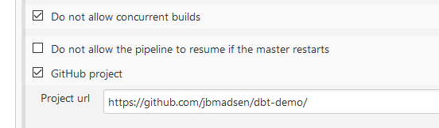
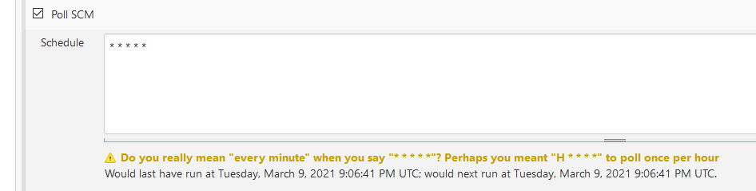
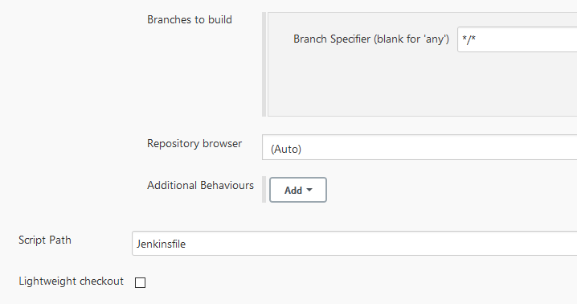

# Jenkins README - Notes for setting up pipeline

1) Setup Github project and whether you allow concurrent builds (we dont) \

2) To simulate our internal environment, we setup a polling solution (1 minute for testing!) \

3) To overcome [this Jenkins bug](https://stackoverflow.com/questions/46684972/jenkins-throws-java-lang-illegalargumentexception-invalid-refspec-refs-heads), we disable lightweight checkout AND set branches to */*, and NOT any of: [EMPTY, NULL, *] \

4) It runs Build, Test, Deploy according to our [Jenkinsfile](./../../Jenkinsfile)

