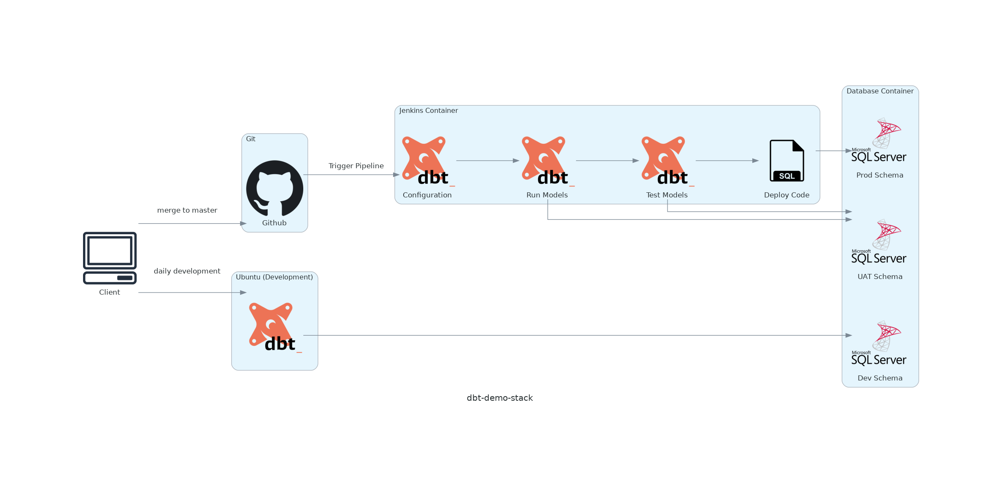

# dbt Demo project in Docker containers

While there are dozens of articles and github repositories on the internet on how to use shiny new tech stacks - unfortunately not all of us are privileged enough to be able to use this - often due to a variety of issues, from management, legal, regulatory, budget, contract issues, etc.
For this demo is for those of us facing the hurdles of having to host everything ourselves, on-prem. So no Fivetran and no Snowflake. No AWS/Azure, no dbt Cloud - none of that fancy new shiny tech. Oh, and no Github Actions or Gitlab Pipelines for that hazzle-free CI/CD.

And, in reality, for a production environment, I would even be hosting this on an on-prem private Git repository.


## Things you might need to do before running

* If you have forked this project, you will want to search and replace all instances of **github.com/jbmadsen/dbt-demo** with whatever you forked it to.
  * This should happen in the following places:
    * [docker/jenkins/jobs/dbt_jenkins_job.groovy](./docker/jenkins/jobs/dbt_jenkins_job.groovy)
    * [docker/sqlserver/sql/helper_scripts/init_update_git.sql](./docker/sqlserver/sql/helper_scripts/init_update_git.sql)
    * [src/models/schedules/git_sync_schedule.yml](./src/models/schedules/git_sync_schedule.yml)
* I usually have my git repositories cloned to **~/git/**. You might have to change this if you have cloned the repository to somewhere different
  * This should happen in the following place:
    * [docker/ubuntu/docker-compose.yml](./docker/ubuntu/docker-compose.yml)


## Run and test (and hopefully it will work!)

Starting docker containers:
> docker-compose -f containers/docker-compose.yml up -d

Testing everything works:

> docker exec -it ubuntu-ext bash \
> #: cd dbt-demo/src \
> #: dbt debug --profiles-dir /home/git/dbt-demo/profiles

Which should display the following, once everything has started up:

```bash
Configuration:
 - profiles.yml file [OK found and valid]
 - dbt_project.yml file [OK found and valid]

Required dependencies:
 - git [OK found]

Connection:
  [...]
  Connection test: OK connection ok
```

You can have a look at what is happending in the docker-compose [here](./docker/readme.md). 


## Workflow visualized




## Tools needed

* Docker
* Docker Compose
* Git
* A Text Editor
* A Terminal

